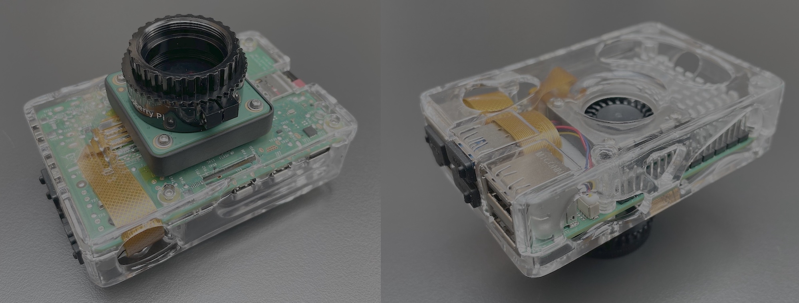
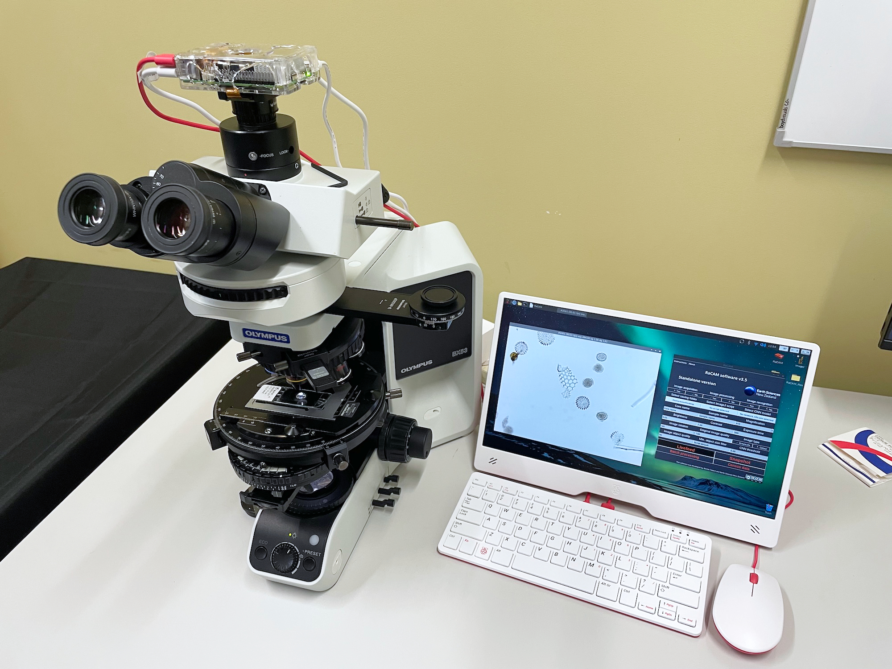
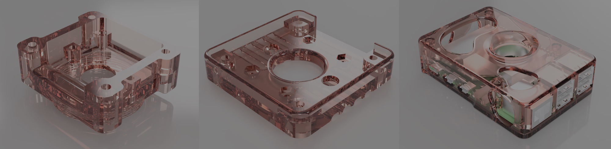

# RaCAM: A Recognition-assisted Camera for Automated Microscopy

RaCAM is a new, affordable, AI-assisted, Raspberry Pi-powered camera, with the first, built-in, and fully automated microscopy workflow (including automated image acquisition, processing and recognition) that can fit any microscope equipped with a C-mount (or CS-mount) camera thread. This camera is equipped with an Raspberry Pi 5 and a high-resolution camera sensor (12.3 mp). Using a new open-source software (RaCAM user interface), written using the Python language, and freely downloadable too, the camera is capable of performing automated acquisition of field of view images, segmenting each visible object of interest, and identifying them using trained CNN onnx models in a few seconds as part of a whole automated workflow.






## Downloadable files

"RaCAM_software.zip": file containing the RaCAM software, required files and directories to run it, installation procedure, ImageJ scripts for automated image segmentation and CNN model to run a test label inference. RaCAM software is a free software (developed using the Python programming language), used to perform image acquisition (using rpicam-apps developed by (© Raspberry Pi Ltd), image processing and segmentation (using the ImageJ software) and image recognition using CNNs.

The RaCAM\_software.zip (containing software, ImageJ scripts, and miso-onnx library developed in this study), is protected under GNU GPLv.3 license (Copyright © 2026 Martin Tetard). This license allows users to freely run, share, and modify software while requiring that any modified versions be distributed under the same license terms, including the disclosure of source code.


"RaCAM_3D_files.zip": file containing 3D models of camera sensor adaptors and camera cases is also available to download to print your own. These 3D designs allow users to 3D-print (preferably using resin), cases for the Raspberry Pi 5 Board, and adaptors to attach camera modules to the board case, and screw it on the C/CS-mount of a microscope. Different adaptor versions are available in the "RaCAM_3D_files.zip" file: A HQ Camera version; a CS-mount threaded version for Camera module V3 and AI camera; a C-mount threaded version for Camera module V3 and AI camera; and a C-mount-adaptor version for Camera module V3 and AI camera. Two versions of the camera cases are also available to be 3D printed.

<a href="https://github.com/microfossil/particle-classification-onnx/blob/main/RaCAM_3D_files.zip">RaCAM_3D_files.zip</a> © 2026 by <a href="https://www.gns.cri.nz/about-us/staff-search/martin-tetard/">Martin Tetard</a> is licensed under <a href="https://creativecommons.org/licenses/by-nc-sa/4.0/">CC BY-NC-SA 4.0</a>. This licence allows use, modification, and redistribution under the same terms for personal purposes only as long as credit is given to the creator, and preventing any commercial use. These resources are open-source and freely available to the public and scientific community. Any private companies willing to use these assets can contact us at martin.tetard@earthsciences.nz to discuss terms and conditions.





## Installation

Softwares / packages be installed on your Raspberry Pi 5 board:

Install python packages:

-Open terminal
-Run:
```
  sudo apt update
  sudo apt upgrade
  sudo apt install python3-pip
  sudo apt install python3-tk
  sudo apt install python3-pil
  sudo apt install python3-pil.imagetk
```

Download and unzip the "RaCAM_software.zip" file: 

-Unzip the "RaCAM_software.zip" file on your Desktop and ensure that the "RaCAM" file, and "RaCAM_files" and "RaCAM_output" folders are located on your desktop.

-Open the "RaCAM" file with a text editor and update lines 3 (Exec=) and 4 (Icon=) by replacing `<user>` with your OS username, and save it. You should now see the "RaCAM" file icon as a camera case after a restart. You should enter the username profile currently in use, and that can be found by looking at the path to the Desktop directory (e.g.: `/home/<user>/Desktop`).

-Double-click on it to start the RaCAM software, you will be prompt to enter your username for updating paths for running the software. You should enter the username profile currently in use, and that can be found by looking at the path to the Desktop directory (e.g.: `/home/<user>/Desktop`).

-Once validated, the software should start successfully and you should be able to see the user interface. The RaCAM software can now be closed as other softwares and packages are required before using it.

-Check if camera is detected and working properly by opening the terminal and running:
```
  rpicam-hello --timeout 0
```
Then you can use "Ctrl+C" in the terminal window, or simply the close button on the preview window to stop rpicam-hello.


Install ImageJ:

-Install ImageJ from "Application menu bar": "Preferences": "Add / Remove software" and look for "Image processing program with a focus on microscopy images" and "Java library for ImageJ". Select both of them then click "Ok".

-Start it in "Application menu bar" under "Education".

-Navigate to `/home/<user>/`. Press "ctrl+h" to show hidden files and folders.

-Open a file manager window, navigate to the "Edit" menu: "Preferences" and select "Don't ask option on launch of executable files" in the "General" tab.

-Go into the `home/<user>/.imagej/` directory.

-Copy the "AutoDiato_RaCAMx40.ijm" and "Adjustable_Watershed.class" files (located in `/home/<user>/Desktop/RaCAM_files/imagej_plugins/`) into the `home/<user>/.imagej/macros` and `home/<user>/.imagej/plugins/`, respectively.


Download and install Miniconda3:

-Run and Follow instructions during Miniconda3 installation. Answer "yes" to the licence terms, and install it in the default location (`/home/<user>/miniconda3`), and answer "yes" when ask to proceed to initilization:
```
  wget repo.anaconda.com
  wget https://repo.anaconda.com/miniconda/Miniconda3-latest-Linux-aarch64.sh
  bash ~/Miniconda3-latest-Linux-aarch64.sh
```

Install packages in Miniconda3 environment:

-Run and accept main terms of service and proceed to installation:
```
  conda create -n miso-onnx python=3.11
  conda activate miso-onnx
  pip install opencv-python
  pip install numpy
  pip install torch
  pip install pillow
  pip install onnxruntime
  pip install git+https://github.com/microfossil/particle-classification-onnx
```

-Check if miso-onnx installation is successfull by running:
```
miso-onnx classify --network-info /home/<user>/Desktop/RaCAM_files/CNN_models/ResNet50_EoceneRadiolaria/model_onnx/network_info.xml --images /home/<user>/Desktop/RaCAM_files/CNN_models/ResNet50_EoceneRadiolaria/simple_test/unlabeled_images --output-csv /home/<user>/Desktop/RaCAM_files/CNN_models/ResNet50_EoceneRadiolaria/simple_test/prediction_file/predictions.csv
```

-This should generate a csv file located in `/RaCAM_files/CNN_models/ResNet50_EoceneRadiolaria/simple_test/prediction_file/`

For more information about the use of onnx model for recognition workflow, visit: https://github.com/microfossil/particle-classification-onnx


# miso-onnx

Inference using ONNX for image classification

## Installation

conda create -n miso-onnx python=3.11

conda activate miso-onnx

pip install git+https://github.com/microfossil/particle-classification-onnx

## Command line interface (CLI)

Classify a folder of images using the `network_info.xml` in the `model_onnx` folder

```
miso-onnx classify --network-info path/to/network_info.xml --images path/to/images --output-csv path/to/output.csv --output-json path/to/output.json --device cpu
```

Use --device cuda for GPU inference, note:

```
Requires cuDNN 9.* and CUDA 12.*, and the latest MSVC runtime. Please install all dependencies as mentioned in the GPU requirements page (https://onnxruntime.ai/docs/execution-providers/CUDA-ExecutionProvider.html#requirements), make sure they're in the PATH, and that your GPU is supported.
```

Full usage:

```
Usage: miso-onnx classify [OPTIONS]

  Classify images using an ONNX model.

  You can provide either:

  1. A network info XML file (--network-info) that contains all configuration,
  OR

  2. Individual parameters (--model and --labels)

  Examples:

      # Using network info XML:     python -m miso-onnx classify --network-
      info model/network_info.xml --images data/images/

      # Using individual parameters:     python -m miso-onnx classify --model
      model.onnx --labels "cat,dog,bird" --images data/images/

      # With output files:     python -m miso-onnx classify --network-info
      model/network_info.xml --images data/images/ \         --output-json
      results.json --output-csv predictions.csv

      # Using CUDA:     python -m miso-onnx classify --network-info
      model/network_info.xml --images data/images/ \         --device cuda
      --batch-size 64

Options:
  --network-info PATH             Path to network info XML file (contains all
                                  model configuration)
  --model PATH                    Path to ONNX model file (required if not
                                  using --network-info)
  --labels TEXT                   Comma-separated labels or path to labels
                                  file (required if not using --network-info)
  --images DIRECTORY              Path to folder containing images to classify
                                  [required]
  --batch-size INTEGER            Batch size for inference (default: 32)
  --num-workers INTEGER           Number of parallel workers for image loading
                                  (default: 4)
  --device [cpu|cuda]             Device to run inference on (default: cpu)
  --output-json PATH              Path to save results as JSON
  --output-csv PATH               Path to save predictions as CSV
  --show-progress / --no-progress
                                  Show progress bars during processing
                                  (default: show)
  --help                          Show this message and exit.
```
