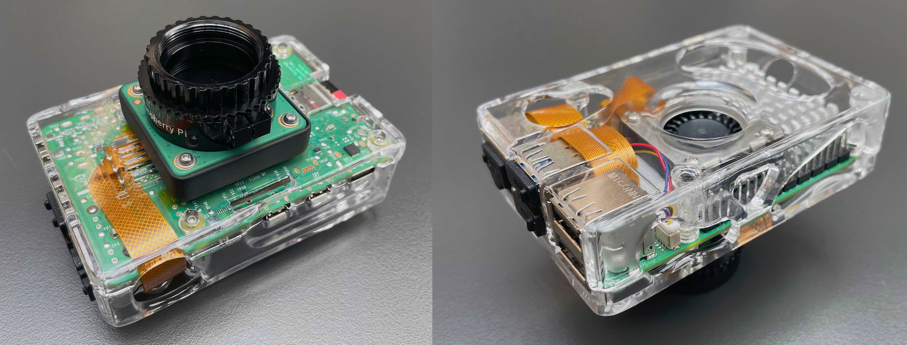
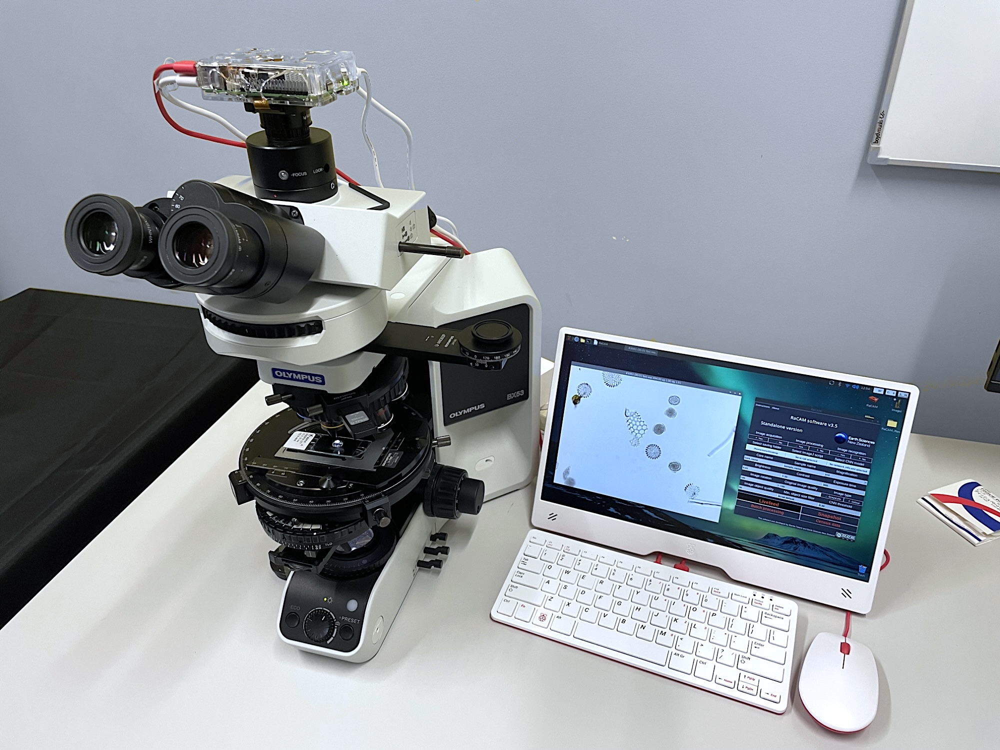
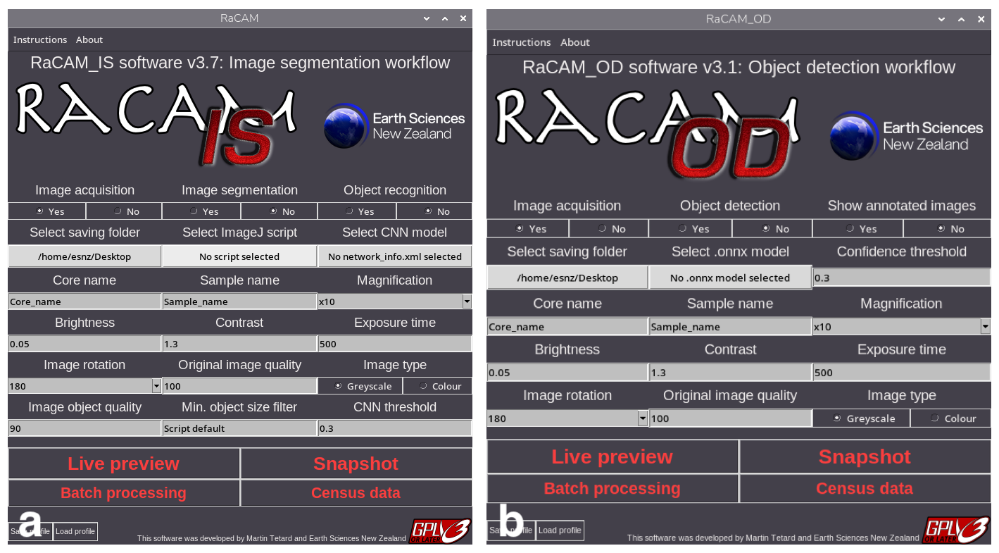
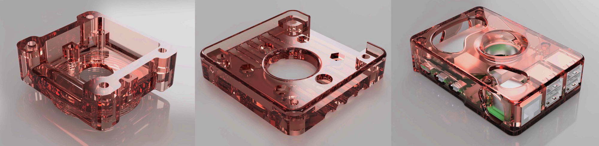
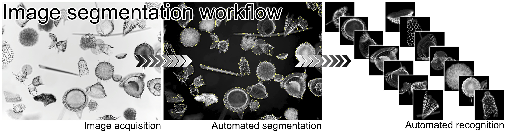
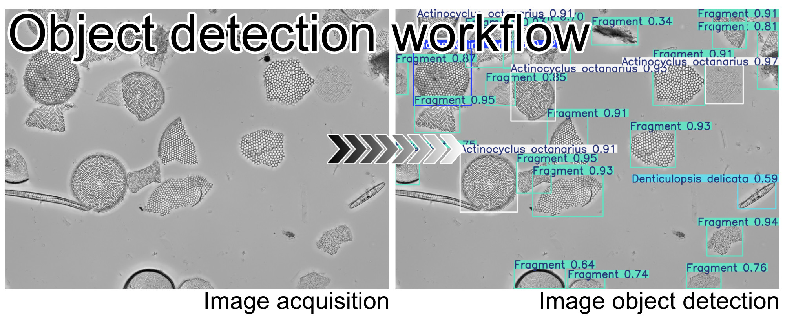
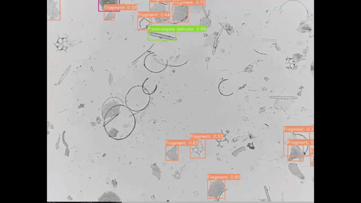

# NEW: RaCAM: A Recognition-assisted Camera for Automated Microscopy


RaCAM is a **new**, **open-source**, **affordable**, and **AI-assisted** Raspberry Pi-powered **camera**, with the two first, built-in, and fully automated microscopy workflows that fits on any microscope equipped with a C-mount (or CS-mount) camera thread. This camera is equipped with an Raspberry Pi 5 and a high-resolution camera sensor (12.3 mp). It is capable of performing automated microscopy, including microfossils / microscopic objects recognition through two different, yet complementary workflows that can be more adapted to your needs, depending on the specific microscopic objects you are working on, and goals you want to achieve. These workflows rely on:

-(1) **image segmentation** (*RaCAM<sub>IS</sub>* software, including image acquisition, and automated processing and recognition),

-(2) **object detection** (*RaCAM<sub>OD</sub>* software including image acquisition and automated still image / live stream object detection using YOLO models), respectively.


The "RaCAM: A Recognition-assisted Camera for Automated Microscopy" manuscript is now <a href="https://egusphere.copernicus.org/preprints/2026/egusphere-2026-2075/">available as a preprint in Biogeosciences</a>!






## Getting started: Downloadable files and hardware

The <a href="https://github.com/microfossil/particle-classification-onnx/blob/main/RaCAM_IS_software.zip">RaCAM_IS_software.zip</a>, <a href="https://github.com/microfossil/particle-classification-onnx/blob/main/RaCAM_OD_software.zip">RaCAM_OD_software.zip</a> and <a href="https://github.com/microfossil/particle-classification-onnx/blob/main/RaCAM_3D_files.zip">RaCAM_3D_files.zip</a> are now available to download.

<a href="https://github.com/microfossil/particle-classification-onnx/blob/main/RaCAM_IS_software.zip">RaCAM_IS_software.zip</a>: file containing the RaCAM_IS software, required files and directories to run it, installation procedure, ImageJ scripts for automated image segmentation. <a href="https://github.com/microfossil/particle-classification-onnx/blob/main/ResNet50_EoceneRadiolaria.zip">ResNet50_EoceneRadiolaria.zip</a> contains an example CNN model to run a test label inference on provided radiolarian images. RaCAM_IS software is a free software (developed using the Python programming language), used to perform image acquisition (using rpicam-apps developed by (© Raspberry Pi Ltd), image processing and segmentation (using the ImageJ software) and image recognition using CNNs.

<a href="https://github.com/microfossil/particle-classification-onnx/blob/main/RaCAM_OD_software.zip">RaCAM_OD_software.zip</a>: file containing the RaCAM_OD software, required files and directories to run it, installation procedure, an example YOLO model to run an inference on a provided diatom field of view image. RaCAM_OD software is a free software (developed using the Python programming language), used to perform image acquisition (using rpicam-apps developed by (© Raspberry Pi Ltd), and object detection on still images and live streams using YOLO models.

The <a href="https://github.com/microfossil/particle-classification-onnx/blob/main/RaCAM_IS_software.zip">RaCAM_IS_software.zip</a> (containing the RaCAM_IS software, ImageJ scripts, and miso-onnx library to run image segmentation), and the <a href="https://github.com/microfossil/particle-classification-onnx/blob/main/RaCAM_OD_software.zip">RaCAM_OD_software.zip</a> (containing the RaCAM_OD software and .onnx model example to run still image and live stream object detection) are protected under <a href="https://www.gnu.org/licenses/gpl-3.0.html">GNU GPLv.3 license</a> (Copyright © 2026 <a href="https://www.gns.cri.nz/about-us/staff-search/martin-tetard/">Martin Tetard</a>). This license allows users to freely run, share, and modify software while requiring that any modified versions be distributed under the same license terms, including the disclosure of source code.





<a href="https://github.com/microfossil/particle-classification-onnx/blob/main/RaCAM_3D_files.zip">RaCAM_3D_files.zip</a>: file containing 3D models of camera sensor adaptors and camera cases is also available to download to print your own. These 3D designs allow users to 3D-print (preferably using resin), cases for the Raspberry Pi 5 Board, and adaptors to attach camera modules to the board case, and screw then on the C/CS-mount of a microscope. Different adaptor versions are available in the "RaCAM_3D_files.zip" file: A HQ Camera version; a CS-mount threaded version for Camera module V2 and AI camera; a C-mount threaded version for Camera module V2 and AI camera; and a C-mount-adaptor version for Camera module V2 and AI camera. Two versions of the camera cases are also available to be 3D printed.

<a href="https://github.com/microfossil/particle-classification-onnx/blob/main/RaCAM_3D_files.zip">RaCAM_3D_files.zip</a> © 2026 by <a href="https://www.gns.cri.nz/about-us/staff-search/martin-tetard/">Martin Tetard</a> is licensed under <a href="https://creativecommons.org/licenses/by-nc-sa/4.0/">CC BY-NC-SA 4.0</a>. This licence allows use, modification, and redistribution under the same terms for personal purposes only as long as credit is given to the creator, and preventing any commercial use. These resources are open-source and freely available to the public and scientific community. Any private companies willing to use these assets can contact us at martin.tetard@earthsciences.nz to discuss terms and conditions.





## Getting started: RaCAM_IS Installation

Image segmentation: Using the RaCAM_IS software, the user can perform image acquisition, and / or automated image processing (segmentation using ImageJ), and / or automated object recognition of the segmented images using trained CNNs. Original, segmented, and classified images can be saved. The software can also perform batch image segmentation and / or object recognition of existing images, and generate summary census data files compiling taxa counts for every sample of a core:




Softwares / packages be installed on the Raspberry Pi 5 board for the RaCAM_IS software to work:

Install python packages:

-Open a new terminal window and run:
```
  sudo apt update
  sudo apt upgrade
  sudo apt install python3-pip
  sudo apt install python3-tk
  sudo apt install python3-pil
  sudo apt install python3-pil.imagetk
```


Download and unzip the "Racam_IS_software.zip" and "ResNet50_EoceneRadiolaria.zip" files: 

-Unzip the "Racam_IS_software.zip" file on your Desktop and ensure that the "RaCAM_IS" file, and "/RaCAM_IS_files/" and "/RaCAM_IS_output/" folders are located on your Desktop.

-Unzip the "ResNet50_EoceneRadiolaria.zip" file and place the "ResNet50_EoceneRadiolaria" folder in the `/RaCAM_IS_files/CNN_models/` directory.

-Navigate to the `/RaCAM_IS_files/` directory located on your Desktop, right-click on the RaCAM_IS.py file and select "Thonny" as default application to open this type of file.

-Right click on the "RaCAM_IS" file located on your Desktop and update lines 3 (Exec=) and 4 (Icon=) by replacing <user> by your OS username (two times total), and save it. You should enter the username profile currently in use, and that can be found by looking at the path to the Desktop directory (e.g.: /home/<user>/Desktop). You should now see the "RaCAM_IS" file icon as a RaCAM camera after a restart of the system.

-Double-click on it to start the RaCAM_IS software, you will be prompt to enter your username for updating paths for running the software. You should enter the username profile currently in use, and that can be found by looking at the path to the Desktop directory (e.g.: `/home/<user>/Desktop`).

-Once validated, the software should start successfully and you should be able to see the user interface. The RaCAM_IS software can now be closed as other softwares and packages are required before using it.

-Check if camera is detected and working properly by opening a new terminal window then running:
```
  rpicam-hello --timeout 0
```

Then you can use "Ctrl+C" in the terminal window, or simply the close button on the preview window to stop rpicam-hello.


Install ImageJ:

-Install ImageJ from "Application menu bar": "Preferences": "Add / Remove software" and look for "Image processing program with a focus on microscopy images" and "Java library for ImageJ". Select both of them then click "Ok".

-Start it in "Application menu bar" under "Education".

-Navigate to `/home/<user>/`. Press "ctrl+h" to show hidden files and folders.

-Open a file manager window, navigate to the "Edit" menu: "Preferences" and select "Don't ask option on launch of executable files" in the "General" tab.

-Go into the `/home/<user>/.imagej/` directory.

-Copy the "AutoRadio_RaCAMx10.ijm" and "Adjustable_Watershed.class" files (located in `/home/<user>/Desktop/RaCAM_IS_files/imagej_plugins/`) into the `/home/<user>/.imagej/macros/` and `/home/<user>/.imagej/plugins/`, respectively.


Download and install Miniconda3:

-Open a new terminal window, then run and follow instructions during Miniconda3 installation. Answer "yes" to the licence terms, and install it in the default location (`/home/<user>/miniconda3/`), and answer "yes" when ask to proceed to initilization::
```
  wget repo.anaconda.com
  wget https://repo.anaconda.com/miniconda/Miniconda3-latest-Linux-aarch64.sh
  bash ~/Miniconda3-latest-Linux-aarch64.sh
```


Install packages in Miniconda3 environment:

-Open a new terminal window, then run and accept main terms of service and proceed to installation:
```
  conda create -n miso-onnx python=3.11
  conda activate miso-onnx
  pip install opencv-python
  pip install numpy
  pip install torch
  pip install pillow
  pip install onnxruntime
  pip install git+https://github.com/microfossil/particle-classification-onnx
```

-Check if miso-onnx installation is successfull by running:
```
miso-onnx classify --network-info /home/<user>/Desktop/RaCAM_IS_files/CNN_models/ResNet50_EoceneRadiolaria/model_onnx/network_info.xml --images /home/<user>/Desktop/RaCAM_IS_files/CNN_models/ResNet50_EoceneRadiolaria/simple_test/unlabeled_images --output-csv /home/<user>/Desktop/RaCAM_IS_files/CNN_models/ResNet50_EoceneRadiolaria/simple_test/prediction_file/predictions.csv
```

-This should generate a csv file located in `/RaCAM_IS_files/CNN_models/ResNet50_EoceneRadiolaria/simple_test/prediction_file/`


## Getting started: RaCAM_OD Installation

Still image detection: Using the RaCAM_OD software, the user can perform image acquisition, and automated object detection directly on captured field of views using a trained .onnx YOLO model. Original and annotated field of view images can be saved, as well as census data txt files for each samples. The software can also perform batch object detection for existing field of view images, and generate summary census data files compiling taxa counts for every sample of a core:



Live stream detection: Using the RaCAM_OD software, the user can also perform live stream object detection using the same .onnx YOLO model. The software is also capable of automatically capture images when a target species is detected:




Softwares / packages be installed on the Raspberry Pi 5 board for the RaCAM_OD software to work:

Install python packages:

-Open a new terminal window, then run:
```
sudo apt update
sudo apt upgrade
sudo apt install python3-pip
sudo apt install python3-tk
sudo apt install python3-pil
sudo apt install python3-pil.imagetk
```


Download and unzip the "Racam_OD_software.zip" file: 

-Unzip the "Racam_OD_software.zip" file on your Desktop and ensure that the "RaCAM_OD" file, and "/RaCAM_OD_files" and "/RaCAM_OD_output" folders are located on your Desktop.

-Navigate to the `/RaCAM_OD_files/` directory located on your Desktop, right-click on the RaCAM_OD.py file and select "Thonny" as default application to open this type of file.

-Right click on the "RaCAM_OD" file located on your Desktop and update lines 3 (Exec=) and 4 (Icon=) by replacing <user> by your OS username (three times total), and save it. You should enter the username profile currently in use, and that can be found by looking at the path to the Desktop directory (e.g.: `/home/<user>/Desktop/`). You should now see the "RaCAM_OD" file icon as a RaCAM camera after a restart of your system.

-Double-click on it to start the RaCAM_OD software, you will be prompt to enter your username for updating paths for running the software. You should enter the username profile currently in use, and that can be found by looking at the path to the Desktop directory (e.g.: `/home/<user>/Desktop/`).

-Once validated, the software should start successfully and you should be able to see the user interface. The RaCAM_OD software can now be closed as other softwares and packages are required before using it.

-Check if camera is detected and working properly by opening a new terminal window,then running:
`rpicam-hello --timeout 0`

Then you can use "Ctrl+C" in the terminal window, or simply the close button on the preview window to stop rpicam-hello.


Create virtual environment, and install ultralytics and onnxruntime packages:

-Open a new terminal window, then run and accept main terms of service if asked to, and proceed to installation:
```
/usr/bin/python3 -m venv --system-site-packages yolo_OD
source yolo_OD/bin/activate
sudo apt update
sudo apt install python3-pip -y
pip install -U pip
pip install ultralytics[export]
pip install numpy picamera2 onnxruntime
```

The ultralytics package install might be long, you can close the terminal afterward.


Run a test inference using the provided trained onnx model:

-Copy the complete "/Core_name/" folder from `/Desktop/RaCAM_OD_files//Test_inference/` into `/Desktop/RaCAM_OD_output/Image_acquisition/`.
-Double click on the "RaCAM_OD" software located on your Desktop to start it:
-Select "Image acquisition: No" and "Object detection: Yes", then select an .onnx model (located in `/Desktop/RaCAM_OD_files/Exported_models/yolo11n1280_diatoms_test.onnx`)
-Click on the "Batch processing" button that will prompt you to select and input core directory. Select and enter the `/Desktop/RaCAM_OD_output/Image_acquisition/Core_name/` directory and click "Ok".
-When the batch processing is done, you should now see a labeled image containing annotated diatom taxa in the `/Desktop/RaCAM_OD_output/Image_recognition/` directory, an a census file in the `/Desktop/RaCAM_OD_output/Raw_census_data/` directory.


# Below is the original miso-onnx code, you should not have to directly use it, unless you want to further development using this technique.

# miso-onnx

Inference using ONNX for image classification


## Installation

conda create -n miso-onnx python=3.11

conda activate miso-onnx

pip install git+https://github.com/microfossil/particle-classification-onnx


## Command line interface (CLI)

Classify a folder of images using the `network_info.xml` in the `model_onnx` folder

```
miso-onnx classify --network-info path/to/network_info.xml --images path/to/images --output-csv path/to/output.csv --output-json path/to/output.json --device cpu
```

Use --device cuda for GPU inference, note:

```
Requires cuDNN 9.* and CUDA 12.*, and the latest MSVC runtime. Please install all dependencies as mentioned in the GPU requirements page (https://onnxruntime.ai/docs/execution-providers/CUDA-ExecutionProvider.html#requirements), make sure they're in the PATH, and that your GPU is supported.
```

Full usage:

```
Usage: miso-onnx classify [OPTIONS]

  Classify images using an ONNX model.

  You can provide either:

  1. A network info XML file (--network-info) that contains all configuration,
  OR

  2. Individual parameters (--model and --labels)

  Examples:

      # Using network info XML:     python -m miso-onnx classify --network-
      info model/network_info.xml --images data/images/

      # Using individual parameters:     python -m miso-onnx classify --model
      model.onnx --labels "cat,dog,bird" --images data/images/

      # With output files:     python -m miso-onnx classify --network-info
      model/network_info.xml --images data/images/ \         --output-json
      results.json --output-csv predictions.csv

      # Using CUDA:     python -m miso-onnx classify --network-info
      model/network_info.xml --images data/images/ \         --device cuda
      --batch-size 64

Options:
  --network-info PATH             Path to network info XML file (contains all
                                  model configuration)
  --model PATH                    Path to ONNX model file (required if not
                                  using --network-info)
  --labels TEXT                   Comma-separated labels or path to labels
                                  file (required if not using --network-info)
  --images DIRECTORY              Path to folder containing images to classify
                                  [required]
  --batch-size INTEGER            Batch size for inference (default: 32)
  --num-workers INTEGER           Number of parallel workers for image loading
                                  (default: 4)
  --device [cpu|cuda]             Device to run inference on (default: cpu)
  --output-json PATH              Path to save results as JSON
  --output-csv PATH               Path to save predictions as CSV
  --show-progress / --no-progress
                                  Show progress bars during processing
                                  (default: show)
  --help                          Show this message and exit.
```
